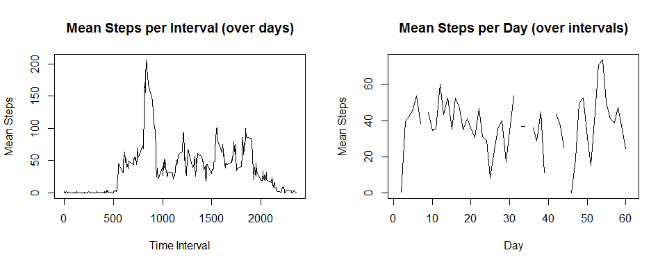

# Reproducible Research: Peer Assessment 1


## Loading and preprocessing the data

Read data from fitness tracker, reshape to a wide table and print the first few
rows/columns of the reshaped table

```r
# Read data file and reshape to wide table
fitData <- read.csv("activity.csv", stringsAsFactors=F)
fitData <- reshape(fitData, timevar="date", idvar="interval", direction="wide")
fitData <- data.frame(fitData[,-1], row.names=fitData[,1])
colnames(fitData) <- gsub("steps.", "", colnames(fitData))

fitData[1:5, 1:6]
```

```
##    2012.10.01 2012.10.02 2012.10.03 2012.10.04 2012.10.05 2012.10.06
## 0          NA          0          0         47          0          0
## 5          NA          0          0          0          0          0
## 10         NA          0          0          0          0          0
## 15         NA          0          0          0          0          0
## 20         NA          0          0          0          0          0
```

## What is mean total number of steps taken per day?

Histogram of total steps per day

```r
totalStepsPerDay <- apply(fitData, 2, sum)
hist(totalStepsPerDay, breaks=15, main="Total Steps Per Day", xlab="Num Steps")
```

 

Mean and median total steps per day

```r
mean(totalStepsPerDay, na.rm=T)
```

```
## [1] 10766.19
```

```r
median(totalStepsPerDay, na.rm=T)
```

```
## [1] 10765
```


## What is the average daily activity pattern?

Plot of mean number of steps per time interval over days and per day over time
intervals

```r
# calculate mean steps over time intervals (row) and days (columns)
intervals <- as.numeric(row.names(fitData))
meanStepsPerInterval <- apply(fitData, 1, mean, na.rm=T)
meanStepsPerDay <- apply(fitData, 2, mean, na.rm=T)

par(mfrow=c(1,2))
plot(intervals, meanStepsPerInterval, type="l", xlab="Time Interval",
     main="Mean Steps per Interval (over days)", ylab="Mean Steps")
plot(meanStepsPerDay, type="l", xlab="Day", ylab="Mean Steps",
     main="Mean Steps per Day (over intervals)")
```

 

Interval with largest mean number of steps

```r
idx <- which(meanStepsPerInterval==max(meanStepsPerInterval))
paste("Most active interval:", intervals[idx])
```

```
## [1] "Most active interval: 835"
```

## Imputing missing values

Impute missing values by random selection of step values.  Since there is more
variation over intervals, perform the sampling for imputation on a per
interval basis.

```r
# copy data frame and impute missing values data over intervals (rows) by random
# sampling of non-missing values in each interval
imputedFitData <- fitData
for(i in 1:nrow(imputedFitData)) {
    idx1 <- which(is.na(imputedFitData[i,]))
    idx2 <- which(!is.na(imputedFitData[i,]))
    imputedFitData[i,idx1] <- sample(imputedFitData[i,idx2], size=length(idx1))
}
imputedFitData[1:5, 1:6]
```

```
##    2012.10.01 2012.10.02 2012.10.03 2012.10.04 2012.10.05 2012.10.06
## 0           0          0          0         47          0          0
## 5           0          0          0          0          0          0
## 10          0          0          0          0          0          0
## 15          0          0          0          0          0          0
## 20          0          0          0          0          0          0
```

Compare histograms, means, and medians of total steps taken per day on raw vs.
imputed data

```r
imputedStepsPerDay <- apply(imputedFitData, 2, sum)
par(mfrow=c(1,2))
hist(totalStepsPerDay, breaks=15, main="Total Steps Per Day (Raw Data)",
     xlab="Num Steps")
hist(imputedStepsPerDay, breaks=15, main="Total Steps Per Day (Imputed Data)",
     xlab="Num Steps")
```

 

```r
sprintf("Mean steps per day. Raw:%0.2f, Imputed:%0.2f",
        mean(totalStepsPerDay, na.rm=T), mean(imputedStepsPerDay))
```

```
## [1] "Mean steps per day. Raw:10766.19, Imputed:10786.59"
```

```r
sprintf("Median steps per day. Raw:%0.2f, Imputed:%0.2f",
        median(totalStepsPerDay, na.rm=T), median(imputedStepsPerDay))
```

```
## [1] "Median steps per day. Raw:10765.00, Imputed:10600.00"
```
Total number of steps per day increase with imputation, but means and medians
don't change much (both numerator and denominator increase)

## Are there differences in activity patterns between weekdays and weekends?

Plot per interval activity on weekdays vs. weekends

```r
# create factor variable indicating weekday/weekend status of each day
day <- weekdays(as.Date(colnames(imputedFitData), format="%Y.%m.%d"))
weekendFlag <- as.factor(ifelse(day %in% c("Saturday","Sunday"),
                                "weekend", "weekday"))

# plot per time interval mean number of steps over weekdays and weekends
par(mfrow=c(2,1), mar=c(0,4.1,4.1,2.1))
plot(intervals, apply(imputedFitData[,weekendFlag=="weekday"], 1, mean, na.rm=T),
     main="Mean Steps per Interval", ylab="Mean Steps", xaxt="n", type="l")
legend("topright", "Weekdays")

par(mar=c(5.1,4.1,0,2.1))
plot(intervals, apply(imputedFitData[,weekendFlag=="weekend"], 1, mean, na.rm=T),
     ylab="Mean Steps", type="l")
legend("topright", "Weekends")
```

 
<BR>Looks like there is more uniform activity on weekends
